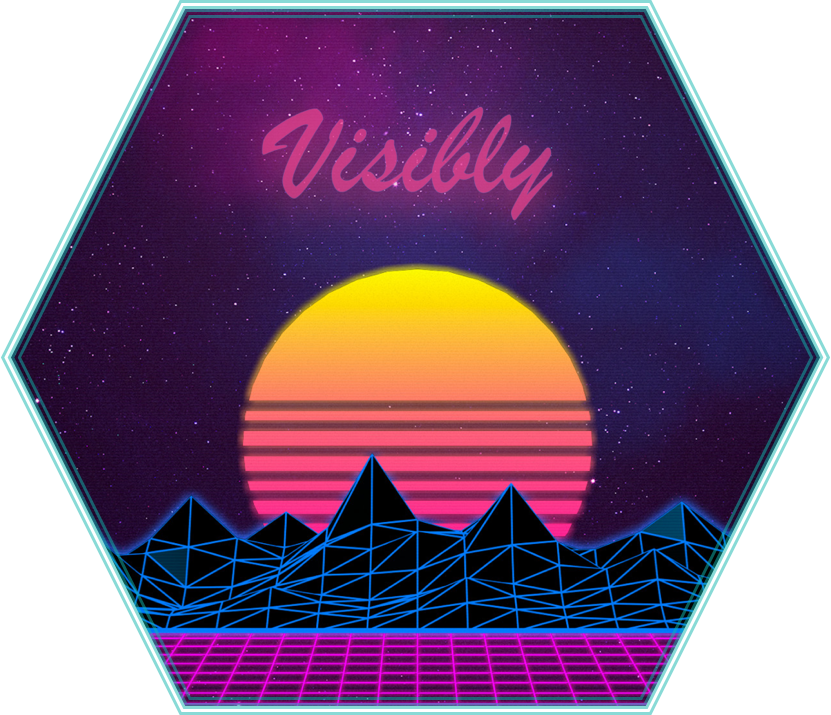
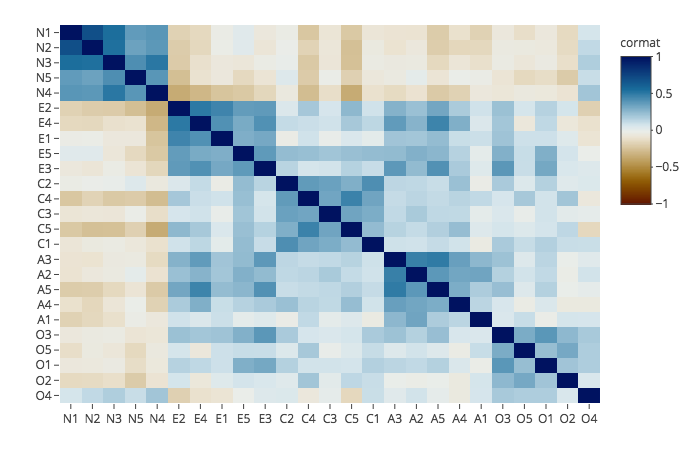
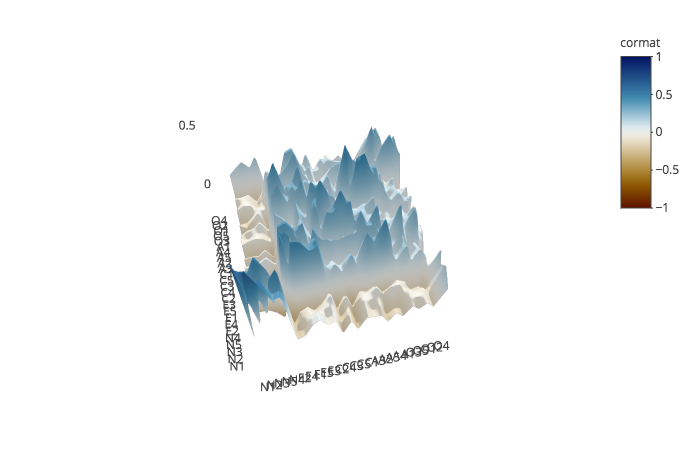

---
output:
  md_document:
    variant: gfm
---

[](https://travis-ci.org/m-clark/visibly)
[](https://ci.appveyor.com/project/m-clark/visibly)
[](https://codecov.io/github/m-clark/visibly?branch=master)
[](https://www.repostatus.org/#active)
[](https://www.tidyverse.org/lifecycle/)


```{r setup, echo=FALSE, include=FALSE, cache=FALSE}
knitr::opts_chunk$set(echo = T, message=F, warning=F, error=F, collapse = TRUE,
                      comment=NA, #R.options=list(width=220),   # code 
                      dev.args=list(bg = 'transparent'), dev='png',                 # viz
                      fig.path = "man/figures/README-",
                      fig.align='center', out.width='75%', fig.asp=.75,                 
                      cache.rebuild=F, cache=F)                                         # cache
```


# visibly




Visibly is a handful of functions I use for color palettes, themes, etc. in R.  Inside you will find:

- some ready-made palettes, e.g. based on R blue and Stan red
- a function to quickly and easily create palettes with using `colortools::complementary` `colortools::adjacent` etc. 
- clean, web-friendly themes for ggplot2 and plotly
- a function to interact with [colorgorical](http://vrl.cs.brown.edu/color/)
- coefficient plots for fixed and random effects, plotting of GAM results.

## Installation

Install the development version directly from GitHub:

```{r install, eval=FALSE}
# install.packages("devtools")
devtools::install_github("m-clark/visibly")
```

Visibly is currently in its early stages, so more may be added soon.  For some additional palettes for those fond of another time, you might be interested in [NineteenEightyR](https://github.com/m-clark/NineteenEightyR).


## Examples

Create a palette from a single starting point. This requires the <span class="pack">colortools</span> package to create equally spaced colors.

```{r example}
library(visibly)
create_palette('papayawhip')
```


Plot it to get a feel for things. 

```{r plot}
create_palette('#ff5500', plot = T)
```

One of the built-in palettes is based on R's blue. Others are based on [Stan's](https://github.com/stan-dev/stan) red, [plotly's](https://github.com/ropensci/plotly) base colors, and the red-blue palette from [RColorBrewer](https://github.com/cran/RColorBrewer/blob/master/R/ColorBrewer.R).


A clean theme for <span class="pack">plotly</span>.

<!-- Plotly does all wonder of screwup here because size is so hard, so just export the png -->

```{r example4, eval=FALSE}
library(plotly)
mtcars %>% 
  plot_ly(x=~wt, y=~mpg, color=~cyl) %>% 
  add_markers(marker=list(size=15)) %>% 
  theme_plotly()
```


Visualize a correlation matrix via factor analysis.

```{r corrheat1, eval=FALSE}
data('bfi', package = 'visibly')
cor_matrix = cor(bfi, use='pair')
corr_heat(cor_matrix)
```


<br>



Plot some model coefficients.  Requires the <span class="pack">scico</span> package.

```{r lm0}
fit_lm = lm(mpg ~ ., mtcars)
plot_coefficients(fit_lm)
```

Plot GAM results

```{r gam}
library(mgcv)
d = gamSim()

gam_model = gam(y ~ x0 + s(x1) + s(x2, bs='gp') + s(x3, bs='ps'), data=d)

plot_gam(gam_model, main_var = x2)
plot_gam_check(gam_model)
```


See the [intro](https://m-clark.github.io/visibly/articles/intro.html) for more.
