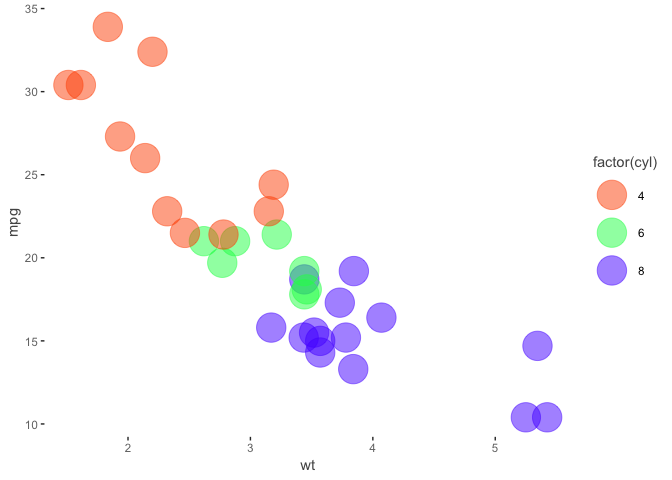

[](https://travis-ci.org/m-clark/visibly)
[](https://codecov.io/github/m-clark/visibly?branch=master)

# visibly


Visibly is a handful of functions I use for color palettes, themes, etc.
in R. Inside you will find:

  - some ready-made palettes, e.g. based on R blue and Stan red
  - a function to quickly and easily create palettes with using
    `colortools::complementary` `colortools::adjacent` etc.
  - clean, web-friendly themes for ggplot2 and plotly
  - a function to interact with
    [colorgorical](http://vrl.cs.brown.edu/color/)

## Installation

The development version then install directly from GitHub:

``` r
# install.packages("devtools")
devtools::install_github("m-clark/visibly")
```

Visibly is currently in its very early stages, so more may be added
soon. For some additional palettes for those fond of another time, you
might be interested in
[NineteenEightyR](https://github.com/m-clark/NineteenEightyR).

## Examples

Create a palette. This requires the `colortools` package to create
equally spaced colors.

``` r
library(visibly)
create_palette('papayawhip')
$papayawhip
[1] "papayawhip"

$complementary
[1] "#FFEFD5" "#D5E5FF"

$analogous
[1] "#FFEFD5" "#FAFFD5" "#FFDAD5"

$split_complentary
[1] "#FFEFD5" "#D5FAFF" "#DAD5FF"

$triadic
[1] "#FFEFD5" "#D5FFEF" "#EFD5FF"

$square
[1] "#FFEFD5" "#D5FFDA" "#D5E5FF" "#FFD5FA"

$tetradic
[1] "#FFEFD5" "#E5FFD5" "#D5E5FF" "#EFD5FF"
```

Plot it to get a feel for things.

``` r
create_palette('#ff5500', plot = T)
```

<!-- -->

    $`#ff5500`
    [1] "#ff5500"
    
    $complementary
    [1] "#FF5500" "#00AAFF"
    
    $analogous
    [1] "#FF5500" "#FFD500" "#FF002B"
    
    $split_complentary
    [1] "#FF5500" "#00FFD4" "#002BFF"
    
    $triadic
    [1] "#FF5500" "#00FF55" "#5500FF"
    
    $square
    [1] "#FF5500" "#2AFF00" "#00AAFF" "#D500FF"
    
    $tetradic
    [1] "#FF5500" "#AAFF00" "#00AAFF" "#5500FF"

There are some other options to express.

``` r
create_palette('#ff5500', 
               alpha = .5, 
               plot = T, 
               name = 'orange_you_glad_you_have_this_color')
```

<!-- --><!-- -->

    $orange_you_glad_you_have_this_color
    [1] "#FF550080"
    
    $complementary
    [1] "#FF550080" "#00AAFF80"
    
    $analogous
    [1] "#FF550080" "#FFD50080" "#FF002B80"
    
    $split_complentary
    [1] "#FF550080" "#00FFD480" "#002BFF80"
    
    $triadic
    [1] "#FF550080" "#00FF5580" "#5500FF80"
    
    $square
    [1] "#FF550080" "#2AFF0080" "#00AAFF80" "#D500FF80"
    
    $tetradic
    [1] "#FF550080" "#AAFF0080" "#00AAFF80" "#5500FF80"

One of the built-in palettes is based on R’s blue. Others are based on
[Stan’s](https://github.com/stan-dev/stan) red,
[plotly’s](https://github.com/ropensci/plotly) base colors, and the
red-blue palette from
[RColorBrewer](https://github.com/cran/RColorBrewer/blob/master/R/ColorBrewer.R).

``` r
palettes$Rblue
$Rblue
[1] "#1f65b7"

$complementary
[1] "#1f65b7" "#b7701f"

$monochromatic
[1] "#1f65b7" "#366caa" "#4a719e" "#5a7491"

$analogous
[1] "#1f65b7" "#241fb7" "#1fb2b7"

$split_complementary
[1] "#1f65b7" "#b2b71f" "#b7241f"

$triadic
[1] "#1f65b7" "#66b71f" "#b71f66"

$tetradic
[1] "#1f65b7" "#b7701f" "#66b71f" "#701fb7"
```

One can create some colors from
[colorgorical](http://vrl.cs.brown.edu/color).

``` r
## colorgorical(n=6, pairPreference = 1, startPalette = list(c(10, -60, 45)), output = 'hex')
[1] "#002B00" "#95C857" "#334D37" "#4EF185" "#378811" "#7FE7D3"
```

## Use

The palette creator can create some decent categorical distinctions
without too much fuss. This also demonstrates one of the themes, which
has no grid/gray, and de-bolds the black font while leaving text clear;
even the fainter version will pass web standards for contrast against a
white background. As shown, you can still fiddle with the theme beyond
that.

``` r
pal = create_palette('#ff5500', 
                     name = 'orange_you_glad_you_have_this_color')
library(ggplot2)
# diamonds
ggplot(mtcars, aes(x=wt, y=mpg)) +
  geom_point(aes(color=factor(cyl)), size=10, alpha=.5) +
  scale_color_manual(values = pal$triadic) +
  theme_trueMinimal()
```

<!-- -->

``` r
library(dplyr)

Attaching package: 'dplyr'
The following objects are masked from 'package:stats':

    filter, lag
The following objects are masked from 'package:base':

    intersect, setdiff, setequal, union
mtcars %>% 
  mutate(cyl = factor(cyl)) %>% 
  tidyext::num_by(wt, cyl) %>% 
  ggplot(aes(x=cyl, y=Mean)) +
  geom_col(aes(fill=cyl), width=.5, alpha=.85) +
  scale_fill_manual(values = palettes$Rblue$triadic) +
  theme_trueMinimal() +
  theme(legend.key.size = unit(.015, 'npc'),
        axis.title.y = element_text(size=20, hjust=-.05))
```

<!-- -->

However, if you want colorblind-safe, print-safe etc., you should use
packages like [viridis](https://github.com/sjmgarnier/viridis) and
[scico](https://github.com/thomasp85/scico).
