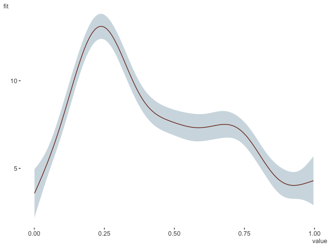

[](https://travis-ci.org/m-clark/visibly)
[](https://ci.appveyor.com/project/m-clark/visibly)
[](https://codecov.io/github/m-clark/visibly?branch=master)
[](https://www.repostatus.org/#active)
[](https://www.tidyverse.org/lifecycle/)

# visibly


Visibly is a handful of functions I use for color palettes, themes, etc.
in R. Inside you will find:

  - some ready-made palettes, e.g. based on R blue and Stan red
  - a function to quickly and easily create palettes with using
    `colortools::complementary` `colortools::adjacent` etc.
  - clean, web-friendly themes for ggplot2 and plotly
  - a function to interact with
    [colorgorical](http://vrl.cs.brown.edu/color/)
  - coefficient plots for fixed and random effects, plotting of GAM
    results.

## Installation

Install the development version directly from GitHub:

``` r
# install.packages("devtools")
devtools::install_github("m-clark/visibly")
```

Visibly is currently in its early stages, so more may be added soon. For
some additional palettes for those fond of another time, you might be
interested in
[NineteenEightyR](https://github.com/m-clark/NineteenEightyR).

## Examples

Create a palette from a single starting point. This requires the
<span class="pack">colortools</span> package to create equally spaced
colors.

``` r
library(visibly)
create_palette('papayawhip')
$papayawhip
[1] "papayawhip"

$complementary
[1] "#FFEFD5" "#D5E5FF"

$analogous
[1] "#FFEFD5" "#FAFFD5" "#FFDAD5"

$split_complentary
[1] "#FFEFD5" "#D5FAFF" "#DAD5FF"

$triadic
[1] "#FFEFD5" "#D5FFEF" "#EFD5FF"

$square
[1] "#FFEFD5" "#D5FFDA" "#D5E5FF" "#FFD5FA"

$tetradic
[1] "#FFEFD5" "#E5FFD5" "#D5E5FF" "#EFD5FF"
```

Plot it to get a feel for
things.

``` r
create_palette('#ff5500', plot = T)
```


    $`#ff5500`
    [1] "#ff5500"
    
    $complementary
    [1] "#FF5500" "#00AAFF"
    
    $analogous
    [1] "#FF5500" "#FFD500" "#FF002B"
    
    $split_complentary
    [1] "#FF5500" "#00FFD4" "#002BFF"
    
    $triadic
    [1] "#FF5500" "#00FF55" "#5500FF"
    
    $square
    [1] "#FF5500" "#2AFF00" "#00AAFF" "#D500FF"
    
    $tetradic
    [1] "#FF5500" "#AAFF00" "#00AAFF" "#5500FF"

One of the built-in palettes is based on R’s blue. Others are based on
[Stan’s](https://github.com/stan-dev/stan) red,
[plotly’s](https://github.com/ropensci/plotly) base colors, and the
red-blue palette from
[RColorBrewer](https://github.com/cran/RColorBrewer/blob/master/R/ColorBrewer.R).

A clean theme for
<span class="pack">plotly</span>.

<!-- Plotly does all wonder of screwup here because size is so hard, so just export the png -->

``` r
library(plotly)
mtcars %>% 
  plot_ly(x=~wt, y=~mpg, color=~cyl) %>% 
  add_markers(marker=list(size=15)) %>% 
  theme_plotly()
```


Visualize a correlation matrix via factor analysis.

``` r
data('bfi', package = 'visibly')
cor_matrix = cor(bfi, use='pair')
corr_heat(cor_matrix)
```


<br>


Plot some model coefficients. Requires the
<span class="pack">scico</span> package.

``` r
fit_lm = lm(mpg ~ ., mtcars)
plot_coefficients(fit_lm)
```


Plot GAM results

``` r
library(mgcv)
d = gamSim()
Gu & Wahba 4 term additive model

gam_model = gam(y ~ x0 + s(x1) + s(x2, bs='gp') + s(x3, bs='ps'), data=d)

plot_gam(gam_model, main_var = x2)
```



``` r
plot_gam_check(gam_model)
```


See the [intro](https://m-clark.github.io/visibly/articles/intro.html)
for more.
